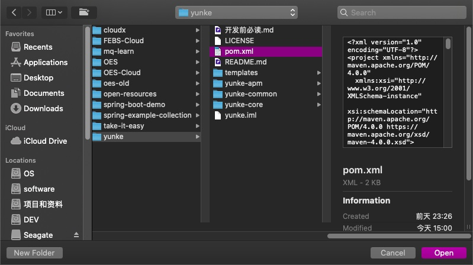
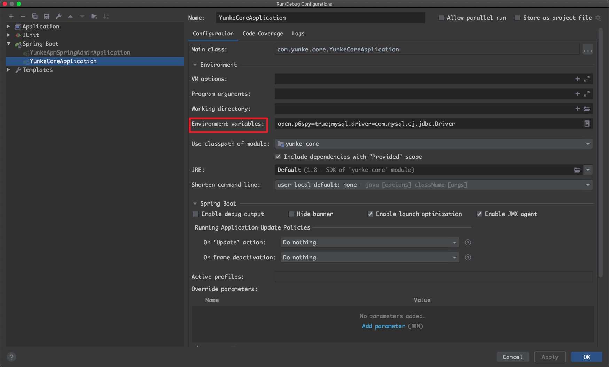

# Yunke

## 如何导入本项目
克隆本项目到本地

`git clone https://xxxxxx.xxxx/yunke.git`

打开 IDEA，选择 open 并指向本项目文件下的 pom.xml 文件，打开后等待依赖下载和打包即可完成项目导入。

## 如何启动本项目

启动本项目之前，请先确保本地环境已经完成 JDK1.8+、Redis 和 MySQL 5.X+ 以上版本的运行环境和相关中间件的安装配置，如果没有请自行百度安装和配置，
如果有，请将项目内 template 文件夹中的 SQL 数据库脚本文件导入到本地数据库，数据库名成统一为 db-yunke，本项目数据库、redis已经部署到服务器，无需
再去调整配置文件参数，如有发现mysql和redis连接异常，请及时在项目群说明。如需要测试sql请把数据库添加到本地自行测试。
同时需要保证 IDEA 已经安装 Lombok 插件。

| 名称 |        默认值         | 可调整启动参数 |
| :---: | :------: |:-------: | 
|   MySQL 用户名   |    root     | mysql.username     |
|   MySQL 密码   |    123456     | mysql.password     |
|   MySQL 端口   |    3306     | mysql.port     |
|   MySQL 主机   |    localhost     | mysql.url     |
|   Redis 主机   |    localhost     | redis.host     |
|   Redis 端口   |    6379     | redis.port     |
|   Redis 密码   |    无     | redis.password     |

##一些规范（必看）

1.  业务接口统一 "I" 开头（强制）
2.  CRUD 统一在 ynuke-core 下的 com.yunke.core.module 内进行（强制）
3.  控制层的方法返回请使用内置 R 方法数据响应体给前端提供分页数据，具体参考 system 模块内控制层的分页写法（强制）
4.  增、删、改的接口和控制方法不要有任何返回值，对可能出现的异常请参考本章第<code>6</code>点（强制）
5.  业务异常或错误请在业务层内抛出 ApiException 异常，不要交给上层处理，具体参考 system 模块内对 ApiException 的用法（强制）
6.  业务注意区分，*Mapper.xml 请放置在对应 module 文件夹下，不要直接暴露 *Mapper.xml（强制）
7.  涉及参数配置的代码请合理考虑参数外部化或统一常量池，尽量减少硬编码
8.  控制器、业务类请使用构造器注入，不要使用 @Autowired、@Resource 等注解
9.  后续再做补充，有不懂的地方群里问

##注意（必看）
1. 接口测试需要认证令牌，没有令牌无法测试，令牌详见群
2. 不要修改项目内的配置文件，一些参数已做参数外部化配置，具体见<code>如何启动本项目</code>章节的内容，基本满足开发需求，需要做修改的请在群内提出以便所有人都清楚
3. 除各自负责的业务问题外，项目框架主体的 BUG 请在群内提出，不要私自修改
